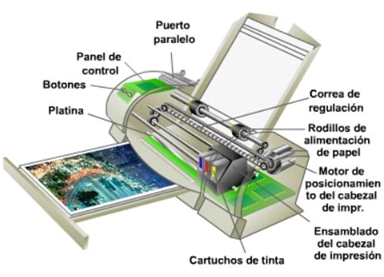
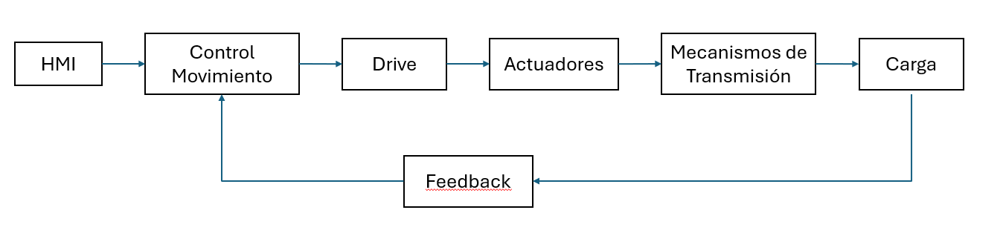
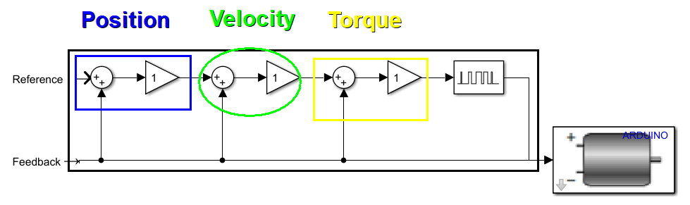

06/02/2025

# Control de Movimiento
El control de movimiento, como su nombre indica, consiste en regular de manera precisa el desplazamiento mecánico de una carga. Este control puede llevarse a cabo mediante diversas tecnologías, entre las cuales se encuentran los sistemas de accionamiento neumático, hidráulico y electromecánico. [1] 

## ¿En qué consiste el Control de Movimiento?
El control de movimiento tiene como objetivo gestionar la posición, velocidad, torque y aceleración. En una máquina, pueden existir múltiples movimientos, denominados axis, cuyos valores de control (posición, velocidad, etc.) deben sincronizarse para optimizar el desempeño del sistema.

## 💡Ejemplo 1

Para facilitar la comprensión de este concepto se desarrolla el siguiente ejemplo:

"Una máquina de impresión está compuesta por un cartucho y su correspondiente mecanismo, el cual se encarga de transferirle energía. Al cartucho se le atribuye un movimiento lineal a lo largo de un eje, mientras que el otro eje corresponde al rodillo que desplaza la hoja de papel. Este rodillo cumple la función de evitar el desperdicio de tinta sobre la hoja, ya sea por exceso de tinta o por una doble aplicación en la misma zona."

Figura 1. Partes de una impresora.

## ¿Cómo se hacía antes del control?

Antes de la implementación de control de movimiento, se empleaban mecanismos de control directos, en los cuales un único motor estaba acoplado al eje. Este eje estaba compuesto por diversos engranajes y mecanismos que modificaban las trayectorias, velocidades y aceleraciones. Además, la sincronización entre los distintos ejes dependía directamente del motor. [2]

### Ventajas:
1. Transmisión precisa entre los ejes, garantizando un movimiento sincronizado.
2. Flexibilidad en el control del movimiento, permitiendo la modificación de velocidad, trayectorias y aceleración según la necesidad del sistema.
4. Alta durabilidad, debido a la resistencia y robustez de sus componentes mecanizados.

### Desventajas:
1. Alto costo de fabricación, debido al mecanizado preciso de sus piezas.
2. Dependencia de un único motor, lo que interrumpía el ciclo de trabajo en caso de fallos mecánicos.
3. Mantenimiento complejo, requiriendo ajustes y reemplazos periódicos de los componentes mecánicos.

## ¿Cuáles son los componentes necesarios?
Al diseñar un sistema de control, es fudamental considerar los siguientes componentes:

1. Human-machine interfaces (HMI)
>🔑 Definición: Facilita la interacción entre el usuario y el sistema de manera intuitiva.

2. Control de movimiento
>🔑 Definición: Comprende elementos como CPU, salida de potencia, las entradas, y los sensores.

3.  Driver de potencia
>🔑 Definición: Regula el flujo de energía que se suministrado a un motor eléctrico.

4. Actuadores
>🔑 Definición: Se encargan de ejecutar el movimiento o acción requerida.

5. Mecanismos de transmisión
>🔑 Definición: Componentesque transfieren el movimiento y la potencia entre distintos elementos del sistema.

6. Retroalimentación (Sensores)
>🔑 Definición: Depende de la aplicación específica. En la mayoría de los casos, se emplea un sensor tipo ecoder, el cual permite medir velocidad, posición y torque.

Figura 2. Componentes de un sistema de control

La Figura 2 muestra la estructura de un sistema de control de movimiento en lazo cerrado, destacando cada proceso necesario para obtener la respuesta deseada. En este sistema, el Feedback tiene la función de enviar información sobre el estado de la carga y el sistema al controlador, permitiendo realizar ajustes en tiempo real para mejorar la precisión y eficiencia del control.

## Problema de control de movimiento
1. Al trabajar con fuerzas y cargas, es fundamental considerar las leyes de Newton. Cuando se aplica una fuerza sobre un objeto, este experimenta una reacción de igual magnitud pero en sentido opuesto, conocida como fuerza negativa. Esta reacción genera un cambio en la velocidad del objeto, un fenómeno denominado *offset* de velocidad.
2. El toque se considera una perturbación para el motor, ya que actúa como una fuerza negativa. Al regular el *torque*, se garantiza una reducción rápida y suave del *offset*, optimizando la dinámica del sistema.
3. Para ejecutar trayectorias curvas con precisión, es fundamental asegurar una dinámica de velocidad altamente rápida.
4. El diseño del driver de potencia debe optimizarse cuidadosamente para mejorar la eficiencia energética y prolongar la vida útil tanto de la electrónica como del motor.

## Sistema de Control en Cascada

Figura 3. Esquema de control

En el esquema anterior se observa un sistema de control en cascada, en el que se da prioridad al control de la variable de respuesta más rápida: El torque. Para ello, se regula la corriente. La segunda variable a controlar es la velocidad, la cual se compara con la retroalimentación correspondiente. La salida de este controlador se utiliza como referencia para el *torque*. Por último, se controla la posición, comparándola con su retroalimentación. La salida de este controlador sirve como referencia para la *velocidad*.

## Aplicaciones prácticas
Podemos encontrar el control de movimiento en diversas aplicaciones, tanto de manera directa como indirecta. Algunos ejemplos incluyen:
1. Transporte de mercancia, en las cadenas de suministros automatizadas.
2. Elevadores.
3. Maquinaria de bobinado.
4. Telar automatizado.
5. Cadenas de empaquetado de alimentos.
6. Fabricación de semiconductores.
7. Ensamble de componentes electrónicos.

# Conclusiones
1. La integración de los sistemas de control de movimiento garantiza una alta precisión en tareas repetitivas, facilitando la automatización de procesos. Esto contribuye a la disminución de los costos operativos, la reducción del tiempo de operación y el aumentando de la eficiencia en diversos sectores ind       ustriales.
2. La combinación de tecnologías como la robótica, inteligencia artificial y el control de movimiento, impulsan la transformación tecnológica en diversas industrias, orientadas a la mejora continua, facilitando su uso e implementación.
3. La implimentación del control de movimiento en procesos que demandan alta precisión y exactitud, como la fabricación de semiconductores y el ensamblaje de componentes electrónicos, garantiza el cumplimiento de las tolerancias y especificaciones requeridas, asegurando así un rendimiento óptimo en la producción. 

# Referencias

[1]	“Login aulas 2025”, Edu.co. [En línea]. Disponible en: https://aulas.ecci.edu.co/mod/resource/view.php?id=217529&forceview=1. [Consultado: 11-feb-2025].

[2] Fundamentos del Control de Movimientos. (n.d.). Retrieved February 11, 2025, from https://www.infoplc.net/files/documentacion/motion_control/infoPLC_net_Fundamentos_de_Control_de_Movimientos.pdf

‌
